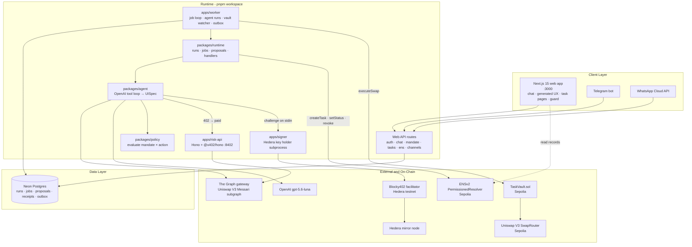
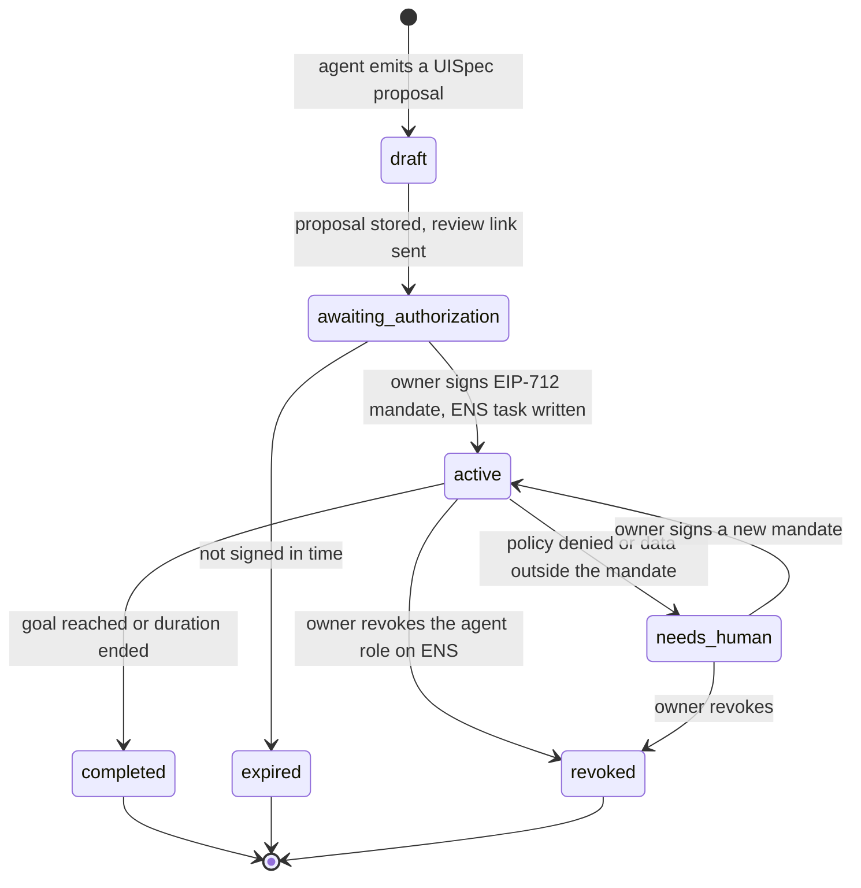
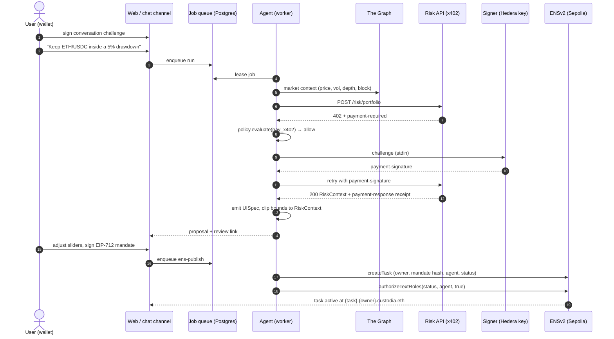
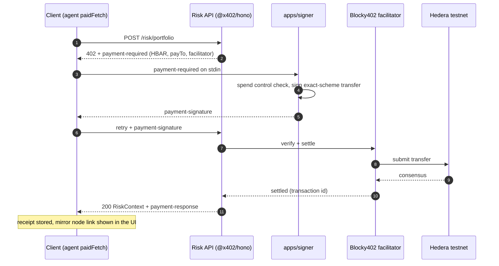

<div align="center">

# 🦅 CustodIA

**Trade with intelligence. Stay in control.**

A chat-native agentic finance runtime where the agent proposes, the human signs a boundary, and a deterministic policy engine enforces it. Every task is an ENSv2 subname with a scoped, revocable agent role; every risk analysis is paid per call with x402 on Hedera; every number the agent shows comes from live The Graph data.


[Overview](#overview) · [Architecture](#architecture) · [How It Works](#how-it-works) · [Quick Start](#quick-start) · [API](#api-endpoints) · [Security](#security-model)

---

</div>

## Table of Contents

- [Submission](#submission)
- [Overview](#overview)
  - [The Problem](#the-problem)
- [Core Features](#core-features)
- [Architecture](#architecture)
- [How It Works](#how-it-works)
  - [Task Lifecycle](#task-lifecycle)
  - [Chat-to-Mandate Flow](#chat-to-mandate-flow)
  - [x402 Payment Flow](#x402-payment-flow)
  - [Real Execution Inside the Boundary (TaskVault)](#real-execution-inside-the-boundary-taskvault)
  - [Paper Trading and Replay](#paper-trading-and-replay)
- [Quick Start](#quick-start)
- [Project Structure](#project-structure)
- [API Endpoints](#api-endpoints)
- [Environment Variables](#environment-variables)
- [Technology Stack](#technology-stack)
- [Sponsor Integration Map](#sponsor-integration-map)
- [Security Model](#security-model)
- [Deployment](#deployment)
- [Ground Truth and Honesty Notes](#ground-truth-and-honesty-notes)

---

## Submission

**ETHGlobal ETHOnline 2026** · Targeting prizes from **Hedera** (AI & Agentic Payments, x402), **The Graph** (AI Tooling / AI Use Case) and **ENS** (Best Use of ENSv2).

- **Pitch video** (≤ 3 min): <https://drive.google.com/file/d/1ulxpN2dAO3fC4MsgamVVB4sMGh5a92xr/view?usp=drive_link>
- **Live demo**: <https://rotation-motherboard-eastern-environmental.trycloudflare.com> (tunnel to the running stack; also runs locally, see [Quick Start](#quick-start))
- **Live demo script**: [`docs/DEMO-SCRIPT.md`](docs/DEMO-SCRIPT.md)
- **AI usage disclosure**: [`AI_USAGE.md`](AI_USAGE.md) · prompt log in [`docs/prompts/`](docs/prompts/)
- **Research and feasibility notes**: [`docs/research/`](docs/research/)
- **Architecture reference**: [`ARCHITECTURE.md`](ARCHITECTURE.md) · canonical flow in [`docs/FLOW.md`](docs/FLOW.md)

### Team

| Name | Telegram | X |
|---|---|---|
| Robert Lopez | [@n0there](https://t.me/n0there) | [@RobGT0](https://x.com/RobGT0) |
| Esteban Brenes | [@EstebanBM03](https://t.me/EstebanBM03) | [@Psy_bre03](https://x.com/Psy_bre03) |
| Angel Estrada | [@Angel2424prog](https://t.me/Angel2424prog) | [@ang40627](https://x.com/ang40627) |
| Julián García Arias | [@juliangarc0](https://t.me/juliangarc0) | [@G16929497](https://x.com/G16929497) |
| Juan David Correa | [@cryptozyzz_web3](https://t.me/cryptozyzz_web3) | [@cryptozyzz_eth](https://x.com/cryptozyzz_eth) |

Workstream ownership and the day-one interface contracts are in [`TEAM.md`](TEAM.md).

---

## Overview

CustodIA is a runtime, not a bot. A user types an intent in a chat (web, Telegram or WhatsApp). The agent researches with live The Graph data, buys a risk analysis with an x402 micropayment on Hedera, and answers with a **generated, schema-validated interface**: sliders, toggles and charts whose bounds are clipped to the risk context, never invented by the model. The user adjusts the boundary and signs it as an EIP-712 mandate. The mandate hash is anchored on an ENSv2 task subname, and the agent receives a role scoped to a single text record on that name. From then on the agent can only act inside the signed limits, and the owner can revoke the role on-chain at any moment.

### The Problem

- AI trading agents are fast, but handing them a private key means one hallucination, bug or prompt injection can drain a wallet.
- "Guardrails" inside a prompt are not guardrails. Nothing stops the model from widening its own authority.
- Agent permissions today are all-or-nothing: an API key, a session key with no scope, or full custody.
- Users cannot see what an agent is about to do in terms they can judge, so they either over-trust or refuse to delegate.
- Revocation is usually a database flag inside the same system that runs the agent.

**CustodIA solves this** by separating intelligence from authority. The LLM only proposes. Every proposed bound is clipped server-side to a deterministic risk context computed from live market data. The human signs the final envelope as a typed mandate. A pure, tested policy engine evaluates every action against that mandate before anything moves. The delegation itself lives on ENSv2 as a scoped text-record role that the owner revokes on-chain, and a TaskVault contract enforces the same limits when execution is real.

---

## Core Features

### Chat-Native Intent

One chat surface for everything: research questions, portfolio inspection, protection, guards, spot and futures envelopes. Market questions stay ephemeral; anything that grants authority becomes a task with its own ENS name. Telegram and WhatsApp are transports paired to the wallet; signing always happens on the web.

### Generated, Schema-Validated UI

The agent emits a `UISpec` (Zod-validated): `price_chart`, `allocation_selector`, `range_slider`, `amount_selector`, `permission_toggle`, `protection_knobs`, `payoff_chart`, `health_meter`, `execution_preview`, `leverage_control`, `strategy_comparison`, `human_escalation`, `risk_summary`. An unknown component or a bound outside the risk envelope is a validation error, never a fallback. The renderer is mobile-first with touch scrubbing on every chart.

### Live Market Context from The Graph

Price, realized volatility and pool depth come from the Uniswap V3 (Messari standardized) subgraph through The Graph gateway. Prices are derived from the pool tick, cached for 30 seconds, and every snapshot carries its block number. No mocked data on the qualifying path.

### Paid Risk Analysis with x402 on Hedera

The risk service is an x402-gated Hono API priced in HBAR and settled through the Blocky402 facilitator. A delegated signer subprocess holds the Hedera key; the agent process never sees it. The policy engine approves the payment before it is signed, and the receipt (transaction id, payer, network) is stored and shown in the generated UI.

### EIP-712 Mandates

An AP2-style open mandate with typed, versioned constraints: `max_notional_usd`, `max_trade_usd`, `max_drawdown_pct`, `allowed_assets`, `allow_rebalance`, `deductible_pct`, `duration_days`, `max_premium_usd`, `max_slippage_bps`, `max_leverage`, `require_stop`, `min_health_factor`. The mandate is bound to the immutable stored proposal it was generated from, so what you sign is what was shown.

### ENSv2 Task Subnames with Scoped, Revocable Roles

Each task is a free wildcard subname `{task}.{owner}.custodia.eth` on a PermissionedResolver. The operator writes owner, mandate hash and agent records; the agent is granted a text-record role for `xyz.custodia.status` only. Revoking the role makes the next agent write revert on-chain with `EACUnauthorizedAccountRoles`.

### Deterministic Policy Engine

`evaluate(mandate, action, state)` is pure, synchronous and fully tested: expiry, asset allowlist, rebalance permission, per-trade and cumulative caps, x402 budget. Spent-to-date is a sum over receipts, never a counter. The refusal moment is a first-class product screen.

### Real Execution Inside the Boundary (TaskVault)

After signing, the owner can deploy a `TaskVault` from the task page and fund it with Sepolia ETH. Orders typed in chat are quoted on Uniswap V3, approved by a policy signer for one action, executed by an execution signer, and the contract itself enforces allowed assets, per-trade and cumulative caps, cooldown, expiry, nonce and the single allow-listed router. Only the owner can withdraw or revoke.

### Paper Trading and History Replay

On any active task, paper fills use the live reference price with configurable fee and slippage assumptions, recorded as receipts with block, time and mandate hash. Replay runs an allocation strategy through the available hourly history against buy-and-hold.

### Durable Runtime

Every chat turn is a run with events and a job on a Postgres queue (`FOR UPDATE SKIP LOCKED`). The worker leases jobs, agent runs are never retried automatically, and channel deliveries go through an outbox. `pnpm verify:durability` proves the crash-safety gate.

---

## Architecture



**Trust Boundaries**

| Boundary | Trust level | Verification |
|---|---|---|
| Browser → web API | Wallet-bound session | HMAC challenge signed by the wallet, single-use nonce, HMAC session cookie |
| Chat channels → web API | Paired transport | Telegram secret token / WhatsApp `X-Hub-Signature-256`; channel is bound to a wallet before it can act |
| LLM → UISpec | Untrusted | Zod validation; every bound clipped server-side to the risk context |
| Agent → x402 payment | Policy-gated | `evaluate()` must allow `pay_x402` before the signer is asked; per-payment spend control in the signer |
| Agent process → Hedera key | Isolated | Key exists only in `apps/signer`; stdin challenge, stdout signature |
| Mandate → stored proposal | Bound | EIP-712 `constraintsHash` verified against the immutable proposal it came from |
| Agent → ENS records | Scoped | Role for `xyz.custodia.status` only; revocation reverts further writes on-chain |
| Worker → TaskVault | Contract-enforced | Execution signer can only call `executeSwap` inside the installed limits; cannot withdraw |

---

## How It Works

### Task Lifecycle



The agent may move `active → needs_human` and `active → completed`. Only the owner's signature moves a task to `active`, and only the owner can revoke. `canTransition(from, to, actor)` in `packages/runtime` is the single source of truth.

### Chat-to-Mandate Flow



### x402 Payment Flow



Wire details that matter: x402 v2 headers are `payment-required` / `payment-signature` / `payment-response` (never `X-PAYMENT`), the facilitator is `api.testnet.blocky402.com`, and mirror-node ids use the `0.0.x-sec-nanos` form. See [`QUICKREF.md`](QUICKREF.md).

### Real Execution Inside the Boundary (TaskVault)

After signing a mandate, the owner can deploy a **TaskVault** from the task page (`contracts/src/TaskVault.sol`, one transaction: deploy plus install the mandate's limits) and fund it with Sepolia ETH. From then on an order in any chat, such as *"swap 0.01 ETH to USDC"*, is executed for real:

```
chat order → policy engine (USD limits, live price) → Uniswap V3 quote
  → policy signer approves that exact action (EIP-712, 2 min)
  → execution signer calls vault.executeSwap → 2 confirmations
  → chat: "Done: swapped 0.01 ETH → 27.6 USDC. Vault now … Tx: https://sepolia.etherscan.io/tx/…"
```

The vault enforces every limit itself: allowed assets (ETH/USDC), per-trade and cumulative caps in raw units, cooldown, expiry, nonce, the single allow-listed router, and output landing in the vault. No server key can move funds outside what was signed. Refusals, off-chain or on-chain, are reported to the chat with the reason.

| Piece | Where |
|---|---|
| Contract and Foundry tests (16 unit, 1 Sepolia fork) | `contracts/` · `forge test`, `forge test --fork-url $SEPOLIA_RPC_URL` |
| ABI, deploy args, quotes, policy signature | `packages/vault` (`pnpm --filter @custodia/vault abi:sync` after `forge build`) |
| Executor (previewed → approved → submitted → confirmed, crash-safe) | `packages/runtime/src/handlers/execute.ts` |
| Chat order parser and routing | `packages/runtime/src/actions.ts`, `packages/runtime/src/handlers/chat.ts` |
| Deploy / deposit / withdraw / revoke UI | `apps/web/app/task/[id]/vault-panel.tsx` |
| Definition of done | `pnpm verify:vault` deploys, funds, executes one order, refuses one over the cap, revokes |

**What the agent does on its own.** The worker re-checks every funded vault once a minute against the signed boundary:

| Signed rule | Trigger | Agent behaviour |
|---|---|---|
| `max_drawdown_pct` | vault value falls that far below its high-water mark | **Executes** ETH → USDC, one per-trade cap at a time, and reports the transaction to every paired chat |
| `allow_rebalance` + signed ETH/USDC target | ETH share drifts more than 5 points | **Proposes** "Reply YES to swap … or NO to skip"; YES executes through the same path, proposal expires after 30 min |
| anything else | — | nothing; "do nothing" is always a valid outcome |

At most one agent-initiated action or proposal per task every 10 minutes, never while another is in flight, always inside the caps the vault enforces. Revoking the vault stops all of it.

### Paper Trading and Replay

On an active task at `/task/<id>`, choose a direction and a paper notional. The first request copies the owner's supported Sepolia ETH/USDC balances into a separate receipt-backed ledger; later requests use that ledger. Fills use the live Uniswap V3 reference price, 5 bps fees and 10 bps adverse slippage by default (both configurable 0 to 1,000 bps). Gas, latency, order-book liquidity and MEV are not modeled. The signed constraints gate every fill and a denial spends nothing.

`POST /api/tasks/:id/replay` replays the allocation strategy through the available hourly history with today's balances placed at the start of the window, and reports against buy-and-hold. It never writes fills or authorizes actions.

---

## Quick Start

**Prerequisites**

- Node.js 22.18+ and pnpm 11 (`corepack enable`)
- A Neon Postgres database (`DATABASE_URL`)
- An OpenAI API key, a The Graph Studio key, a WalletConnect project id
- Sepolia: a registered parent name with a PermissionedResolver, two funded EOAs (operator, agent). See [`packages/ens/README.md`](packages/ens/README.md)
- Hedera testnet: a portal account (email sign-up, ECDSA key) for the signer and a payee account. See [`apps/signer/README.md`](apps/signer/README.md)
- Foundry (`foundryup`), only for the TaskVault contract

### Setup

```bash
git clone https://github.com/r0bops/CustodIA.git
cd CustodIA
pnpm install
cp .env.example .env                     # fill the root values
cp apps/signer/.env.example apps/signer/.env   # Hedera key lives ONLY here
pnpm db:migrate
```

Optional helpers that create the on-chain prerequisites from the terminal:

```bash
pnpm ens:setup      # deploys the PermissionedResolver and wires custodia.eth
pnpm hedera:setup   # creates the payee account and prints RISK_API_PAYTO
```

### Start the Application

```bash
pnpm dev            # risk-api :8402 · web :3000 · worker, in parallel
```

| Service | URL |
|---|---|
| Web app (chat, tasks, guard pages) | http://localhost:3000 |
| Risk API (x402) | http://localhost:8402 |
| Worker | background job loop, logs in the same terminal |

Open http://localhost:3000/chat, connect a Sepolia wallet, sign the conversation, claim `{label}.custodia.eth`, and type one of the verified prompts:

| Prompt | Result |
|---|---|
| `What is ETH doing today?` | ephemeral research with a live chart |
| `Show my Sepolia portfolio` | wallet card with ETH, USDC, WETH and block provenance |
| `Protect me if ETH drops more than 15%` | position protection with payoff chart |
| `Keep ETH/USDC inside a 5% drawdown` | portfolio guard: allocation, drawdown, trade cap, rebalance toggle |
| `Buy 500 USDC of ETH` | spot confirmation inside the envelope |
| `Buy 50000 USDC of ETH` | human escalation: outside the envelope, not authorizable |
| `Compare ETH and USDC allocations` | strategy comparison, grants no authority |

### Verify the Sponsor Integrations

Each script talks to live infrastructure and exits non-zero on failure.

```bash
pnpm verify:graph        # subgraph ids resolve, prints ETH price and 24 h realized vol with block
pnpm verify:x402         # one paid request settles on Hedera, mirror node shows it, HashScan link
pnpm verify:ens          # task A revoked ⇒ agent write reverts EACUnauthorizedAccountRoles; task B still writable
pnpm verify:durability   # crash-safe job queue and run events
pnpm verify:vault        # deploy, fund, execute one order, refuse one over the cap, revoke
pnpm demo:e2e            # full driver: sign-in, ENS claim, all prompts, mandate, simulate, revoke, screenshots
```

### Quality Gate

```bash
pnpm typecheck && pnpm lint && pnpm test
cd contracts && forge test -vv
```

---

## Project Structure

```
CustodIA/
├── apps/
│   ├── web/                     # Next.js 15: chat, generated UX, task/guard/audit pages, API routes, channel webhooks
│   ├── worker/                  # Job loop: agent runs, ENS publish, vault executor and watcher, outbox delivery
│   ├── risk-api/                # Hono + @x402/hono, POST /risk/portfolio priced in HBAR (:8402)
│   └── signer/                  # Delegated x402 signer subprocess; the only place the Hedera key exists
├── packages/
│   ├── schema/                  # Zod contracts: UISpec, Mandate, constraints, MarketContext, RiskContext, Receipt
│   ├── agent/                   # OpenAI tool loop → UISpec; paidFetch; portfolio reader; bound clipper
│   ├── policy/                  # Pure evaluate(mandate, action, state) with full test coverage
│   ├── decision/                # Intent routing and task templates
│   ├── graph/                   # The Graph adapter (Uniswap V3 Messari subgraph, tick-derived prices, cache)
│   ├── ens/                     # ENSv2 ops: createTask, setStatus, revokeAgent, resolveTask; hand-rolled ABI
│   ├── registry/                # Asset capability registry (ETH, USDC evaluable; WETH observable)
│   ├── vault/                   # TaskVault ABI, deploy args, Uniswap quotes, policy signatures
│   ├── runtime/                 # Durable runs, jobs, proposals, lifecycle, chat/ens/execute handlers
│   └── db/                      # Drizzle schema, migrations, Neon HTTP and pooled clients, PGlite tests
├── contracts/                   # TaskVault.sol + Foundry tests (unit and Sepolia fork)
├── scripts/                     # verify:* proofs, ens/hedera setup, e2e driver with screenshots
├── docs/
│   ├── FLOW.md                  # Canonical user → agent → chain flow
│   ├── DEMO-SCRIPT.md           # Live demo script with verified prompts
│   ├── research/                # Feasibility, per-sponsor research, judges, strategy
│   ├── prompts/                 # AI prompt log (hackathon transparency)
│   └── superpowers/             # Specs and execution plans (v0, v1, v1.1 addendum, TaskVault scope)
├── ARCHITECTURE.md              # Condensed topology and data-flow reference
├── AI_USAGE.md                  # AI assistance transparency log
├── QUICKREF.md                  # Verified constants and traps; wins over any other doc
├── PRODUCT.md · TEAM.md · TRACKS.md · AGENTS.md
└── .env.example
```

---

## API Endpoints

**Authentication**

| Mechanism | Description |
|---|---|
| Session cookie | Issued by `POST /api/auth/verify` after the wallet signs the challenge from `POST /api/auth/challenge`. Single-use nonce, HMAC-signed, bound to a conversation id. |
| `payment-signature` header | x402 payment authorization on the Risk API. Produced by `apps/signer`. |

### Web app — `:3000/api`

| Method | Path | Description | Auth |
|---|---|---|---|
| POST | `/auth/challenge` | Conversation challenge for the wallet to sign | None |
| POST | `/auth/verify` | Verify signature, set session cookie, report ENS identity | None |
| GET | `/identity` | Wallet, ENS name and claim state for the session | Session |
| GET | `/welcome` | Identity-aware greeting for chat surfaces | Session |
| POST | `/chat` | Enqueue a run for a message; returns run id | Session |
| GET | `/runs/[id]/events` | Run events as JSON snapshot, or SSE with `Accept: text/event-stream` | Session |
| GET | `/proposals/[id]` | Stored immutable proposal (UISpec + market + risk) | Session |
| POST | `/mandate` | Verify EIP-712 mandate against its proposal, enqueue ENS publish (409 if not authorizable) | Session |
| GET | `/market` | Live market context for the UX lab and charts | None |
| GET | `/ens/available` | Check a `{label}.custodia.eth` label | Session |
| POST | `/ens/claim` | Mint the owner identity subname | Session |
| POST | `/ens/claim-chat` · `/ens/release-chat` | Claim or release from a chat channel | Paired channel |
| GET | `/tasks/[id]` | Task with ENS records, mandate, receipts and status | Session (owner) |
| POST | `/tasks/[id]/simulate` | Paper fill through the policy engine | Session (owner) |
| POST | `/tasks/[id]/replay` | Replay allocation strategy over history | Session (owner) |
| POST | `/tasks/[id]/revoke` | Revoke the agent's ENS role, mark revoked | Session (owner) |
| POST | `/tasks/[id]/vault` | Record deployed vault, deposits, withdrawals | Session (owner) |
| GET | `/inbox` · `/inbox/proposals/[id]` | Pending agent proposals (rebalance YES/NO) | Session |
| POST | `/channels/pair` · `/channels/connect` | Bind Telegram / WhatsApp to the wallet | Session |
| POST | `/telegram` · `/whatsapp` | Channel webhooks | Platform secret |
| POST | `/cron` | Reserved watcher route, returns 501 until enabled | `CRON_SECRET` |

### Risk API — `:8402`

| Method | Path | Description | Auth |
|---|---|---|---|
| GET | `/health` | Liveness probe | None |
| POST | `/risk/portfolio` | Deterministic `RiskContext` from live Graph data: volatility, concentration, trade envelope, drawdown range | `payment-signature` (x402, HBAR) |

---

## Environment Variables

### AI provider — `.env`

| Variable | Description | Default |
|---|---|---|
| `OPENAI_API_KEY` | OpenAI key for the agent tool loop | — |
| `OPENAI_MODEL` | Agent model | `gpt-5.6-luna` |
| `OPENAI_REASONING_EFFORT` | `none` required for Luna function tools; `low` for Terra | `none` |

### Data and identity — `.env`

| Variable | Description | Default |
|---|---|---|
| `GRAPH_STUDIO_KEY` | The Graph Studio API key (gateway) | — |
| `DATABASE_URL` | Neon Postgres connection string | — |
| `SEPOLIA_RPC_URL` | Sepolia JSON-RPC | — |
| `ENS_PARENT_NAME` | Parent name that owns all task subnames | `custodia.eth` |
| `ENS_RESOLVER_ADDRESS` | PermissionedResolver deployed by `pnpm ens:setup` | — |
| `ENS_OPERATOR_PRIVATE_KEY` | Owns the name and resolver; writes owner/mandate/agent records | — |
| `AGENT_PRIVATE_KEY` | Delegated agent; may write only `xyz.custodia.status` | — |

### x402 risk service — `.env`

| Variable | Description | Default |
|---|---|---|
| `FACILITATOR_URL` | Must be Blocky402; `x402.org` fails the Hedera track | `https://api.testnet.blocky402.com` |
| `HEDERA_NETWORK` | CAIP-2 network | `hedera:testnet` |
| `RISK_API_PAYTO` | Receiving Hedera account (`0.0.x`) | — |
| `RISK_API_URL` | Where the agent finds the risk service | `http://localhost:8402` |
| `X402_MAX_HBAR_PER_TASK` | Prototype x402 budget per task | `1` |

### Web, channels and execution — `.env`

| Variable | Description | Default |
|---|---|---|
| `NEXT_PUBLIC_WALLETCONNECT_PROJECT_ID` | WalletConnect project id | — |
| `SESSION_SECRET` | HMAC secret for challenges and session cookies | — |
| `APP_URL` | Public origin used in links sent to chat channels | — |
| `TELEGRAM_BOT_TOKEN` · `TELEGRAM_BOT_USERNAME` · `TELEGRAM_WEBHOOK_SECRET` | Telegram transport | — |
| `WHATSAPP_ACCESS_TOKEN` · `WHATSAPP_PHONE_NUMBER_ID` · `WHATSAPP_BUSINESS_NUMBER` · `WHATSAPP_APP_SECRET` · `WHATSAPP_VERIFY_TOKEN` | WhatsApp Cloud API transport | — |
| `CRON_SECRET` | Guards the reserved watcher route | — |
| `EXECUTION_PRIVATE_KEY` | Only key allowed to call `TaskVault.executeSwap`; needs gas; cannot withdraw | — |
| `POLICY_SIGNER_PRIVATE_KEY` | Approves one bounded action for 2 minutes; never transacts | — |

### Signer — `apps/signer/.env` (never in the root)

| Variable | Description | Default |
|---|---|---|
| `HEDERA_CLIENT_ID` | Paying Hedera account | — |
| `HEDERA_CLIENT_KEY` | ECDSA private key, exists only in this process | — |
| `HEDERA_NETWORK` | CAIP-2 network | `hedera:testnet` |
| `RISK_API_PAYTO` | Trusted recipient the signer will pay | — |
| `SIGNER_MAX_TINYBAR_PER_PAYMENT` | Per-payment spend ceiling | `10000000` (0.1 ℏ) |

---

## Technology Stack

### Frontend

| Layer | Technology |
|---|---|
| Framework | Next.js 15 (App Router), React 19 |
| Styling | CSS variables (`--custodia-*`), navy/teal, Inter; inline-SVG charts with touch scrubbing |
| Web3 | wagmi v2, viem, WalletConnect (EIP-712 signing) |
| Channels | Telegram Bot API, WhatsApp Cloud API |

### Backend

| Layer | Technology |
|---|---|
| Workspace | pnpm monorepo, TypeScript, Biome, Vitest |
| Agent | OpenAI SDK, `chat.completions.runTools` with Zod function tools, `gpt-5.6-luna` |
| Risk service | Hono, `@x402/hono` + `@x402/hedera` (pinned 2.25.0) |
| Runtime | Postgres job queue (`FOR UPDATE SKIP LOCKED`), outbox, run events, lifecycle state machine |
| Database | Neon Postgres, Drizzle ORM, PGlite for SQL tests |

### Blockchain and Domain

| Layer | Technology |
|---|---|
| Chains | Sepolia (11155111), Hedera testnet |
| Identity | ENSv2 wildcard subnames, PermissionedResolver via VerifiableFactory, Enhanced Access Control text roles |
| Payments | x402 v2 exact scheme in HBAR, Blocky402 facilitator, mirror-node receipts |
| Data | The Graph gateway, Uniswap V3 Messari standardized subgraph |
| Execution | `TaskVault.sol` (Solidity 0.8, Foundry), Uniswap V3 SwapRouter on Sepolia |
| Mandates | EIP-712 typed data, AP2-style open mandate with versioned constraint types |

---

## Sponsor Integration Map

Where the load-bearing code lives.

| Sponsor | What we use | Files |
|---|---|---|
| **Hedera** | x402 exact scheme, delegated signing, settlement through Blocky402 | `apps/signer/x402-sign.ts` (key holder) · `packages/agent/src/x402.ts` (`paidFetch`, serialized) · `apps/risk-api/src/app.ts` (payment middleware, price) · `apps/risk-api/src/config.ts` (Blocky402-only guard) · `scripts/verify-x402.ts` |
| **The Graph** | Uniswap V3 subgraph as the live data source through the public gateway | `packages/graph/src/index.ts` (pool constant verified by name, tick-derived price, `getMarketContext`) · `packages/db/src/market-cache.ts` · `scripts/verify-graph.ts` |
| **ENS** | ENSv2 wildcard subnames, PermissionedResolver, scoped text-role delegation and revocation | `packages/ens/src/ops.ts` (`createTask`, `setStatus`, `revokeAgent`) · `packages/ens/src/abi.ts` · `packages/runtime/src/handlers/ens-publish.ts` · `scripts/verify-ens.ts` · `scripts/ens-setup.ts` |
| Policy | The refusal moment and the pre-payment gate | `packages/policy/src/index.ts` (`evaluate`) |
| Agent | LLM tool loop producing schema-validated UI, server-side bound clipping | `packages/agent/src/index.ts` · `packages/agent/src/clipper.ts` · `packages/agent/src/compose.ts` |
| Vault | Real execution inside the signed boundary | `contracts/src/TaskVault.sol` · `packages/vault` · `packages/runtime/src/handlers/execute.ts` |

---

## Security Model

The agent never holds authority. Authority is a signed mandate, enforced by a pure policy engine off-chain and by the TaskVault on-chain, and delegated as a revocable ENSv2 role.

### Key Security Properties

| Property | Implementation |
|---|---|
| Bounds are not LLM output | Risk numbers are computed deterministically in the Risk API from Graph data; the agent's UISpec is clipped server-side before it is accepted |
| Mandate integrity | EIP-712 with `constraintsHash`, verified against the immutable stored proposal (`proposalId`, strict body) |
| Only authorizable proposals can be signed | `needs_human` and `compare_strategies` intents are refused with 409 at `/api/mandate` |
| Session binding | Wallet-signed challenge with a consumed-nonce table; HMAC session cookie bound to a conversation id |
| Payment gate | `evaluate(pay_x402)` runs before the signer is asked; the signer enforces its own per-payment ceiling and trusted payee |
| Key isolation | Hedera key only in `apps/signer`; execution and policy signer keys only in the worker; no key reaches the web client or the LLM process |
| Scoped delegation | Agent ENS role limited to `xyz.custodia.status`; revocation reverts further writes on-chain |
| Spend accounting | Spent-to-date is a sum over receipts, never a mutable counter |
| On-chain enforcement | TaskVault checks assets, caps, cooldown, expiry, nonce and router itself; only the owner can withdraw |

### Attack Resistance

| Attack vector | Status | Mechanism |
|---|---|---|
| Prompt injection widens the envelope | ✅ Mitigated | Bounds clipped to the risk context; mandate signed by the human; policy engine has no LLM |
| Signing a different proposal than shown | ✅ Mitigated | Mandate bound to the stored proposal id and its constraints hash |
| Replayed sign-in challenge | ✅ Mitigated | Single-use nonce consumed in Postgres |
| Agent keeps acting after revocation | ✅ Mitigated | ENS write reverts with `EACUnauthorizedAccountRoles`; vault revocation stops the executor |
| Runaway x402 spend | ✅ Mitigated | Policy budget per task, signer per-payment ceiling, one payment attempt per turn |
| Execution key drains the vault | ✅ Mitigated | Execution signer cannot withdraw; every swap must land in the vault and pass on-chain caps |
| Duplicate job execution after a crash | ✅ Mitigated | Leased jobs with `SKIP LOCKED`, idempotent request ids, agent runs never retried automatically |
| Stale market data | ✅ Mitigated | Snapshots carry block number and fetch time; cache TTL is 30 s |
| MEV / sandwich on vault swaps | ⚠️ Partial | Slippage cap in the mandate and quote; no private RPC on Sepolia |
| Channel identity spoofing | ⚠️ Partial | Platform signatures verified; a channel acts only after wallet pairing, but signing still happens on the web |
| Single operator for ENS records | ⚠️ Partial | Operator-owned parent name in v1; user-minted subnames are on the roadmap |

Known gaps are listed honestly in [`docs/AVANCES-2026-09-12.md`](docs/AVANCES-2026-09-12.md) and the specs under `docs/superpowers/`.

---

## Deployment

CustodIA runs today as a local stack against live testnets. The pieces deploy independently.

### Web → Vercel

```bash
cd apps/web
vercel link
vercel env pull                          # or add each root variable from .env.example
vercel deploy --prod
# Point Telegram/WhatsApp webhooks at https://<host>/api/telegram and /api/whatsapp
```

### Worker, Risk API and Signer → any Node 22 host

```bash
pnpm install --prod=false && pnpm build
pnpm --filter @custodia/risk-api start   # :8402, needs apps/signer/.env next to it
pnpm --filter @custodia/worker start     # needs DATABASE_URL, RPCs, execution and policy keys
```

The signer is spawned by the agent as a subprocess, so it must live on the same host as the worker, with its own `.env`.

### Contracts → Sepolia (Foundry)

```bash
cd contracts
forge build && forge test -vv
pnpm --filter @custodia/vault abi:sync   # refresh the ABI used by the runtime
# TaskVault is deployed per task by the owner from the task page (one transaction)
```

---

## Ground Truth and Honesty Notes

- [`QUICKREF.md`](QUICKREF.md) is the verified-against-live-infrastructure reference for every hardcoded address and endpoint. If any document contradicts it, `QUICKREF.md` wins.
- `xyz.custodia.*` ENS record keys are ours. This project is **AP2-style**, not AP2-compliant; the device and trust-layer requirements of AP2 are out of scope and no claim is made otherwise.
- Sepolia and Hedera testnet only. Test tokens have no cash value; USD figures use mainnet reference prices and are labeled as simulated.
- Protection premiums are model estimates, not venue quotes, and not insurance. Futures envelopes are simulated in this build.
- The Aave collateral adapter and the HCS audit path exist in the tree as experiments and are not on the qualifying demo path.

<div align="center">

**Built for ETHGlobal ETHOnline 2026. The agent proposes. The human signs the boundary. Policy enforces it.**

</div>
